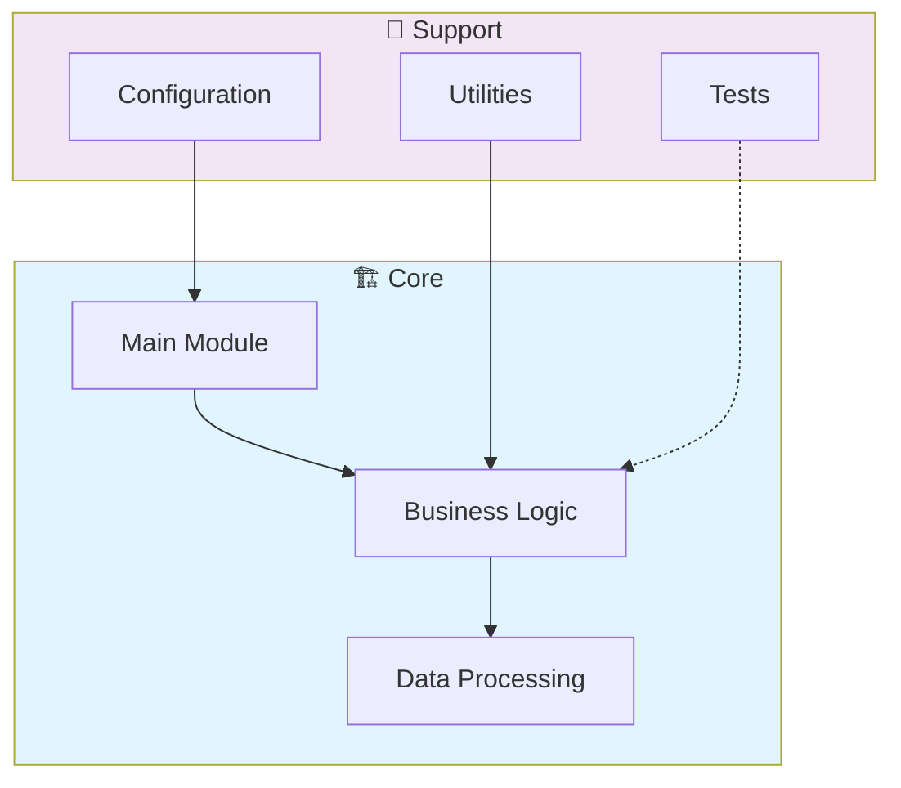

# 📊 Big Data Analytics Platform

> Professional project by Gabriel Demetrios Lafis


[English](#english) | [Português](#português)

---

## English

### 🎯 Overview

**Big Data Analytics Platform** is a production-grade Python application complemented by CSS, HTML, Shell that showcases modern software engineering practices including clean architecture, comprehensive testing, containerized deployment, and CI/CD readiness.

The codebase comprises **1,154 lines** of source code organized across **7 modules**, following industry best practices for maintainability, scalability, and code quality.

### ✨ Key Features

- **📊 Interactive Visualizations**: Dynamic charts with real-time data updates
- **🎨 Responsive Design**: Adaptive layout for desktop and mobile devices
- **📈 Data Aggregation**: Multi-dimensional data analysis and filtering
- **📥 Export Capabilities**: PDF, CSV, and image export for reports
- **🔄 Data Pipeline**: Scalable ETL with parallel processing
- **✅ Data Validation**: Schema validation and quality checks
- **📊 Monitoring**: Pipeline health metrics and alerting
- **🔧 Configurability**: YAML/JSON-based pipeline configuration

### 🏗️ Architecture



### 🚀 Quick Start

#### Prerequisites

- Python 3.12+
- pip (Python package manager)

#### Installation

```bash
# Clone the repository
git clone https://github.com/galafis/Big-Data-Analytics-Platform.git
cd Big-Data-Analytics-Platform

# Create and activate virtual environment
python -m venv venv
source venv/bin/activate  # On Windows: venv\Scripts\activate

# Install dependencies
pip install -r requirements.txt
```

#### Running

```bash
# Run the application
python src/main.py
```

### 🧪 Testing

```bash
# Run all tests
pytest

# Run with coverage report
pytest --cov --cov-report=html

# Run specific test module
pytest tests/test_main.py -v

# Run with detailed output
pytest -v --tb=short
```

### 📁 Project Structure

```
Big-Data-Analytics-Platform/
├── examples/
│   └── basic_usage.py
├── scripts/
│   └── branch-helper.sh
├── src/          # Source code
│   ├── data_processor.py
│   └── test_data_processor.py
├── web/
├── API_DOCUMENTATION.md
├── AUDIT_REPORT.md
├── CHANGELOG.md
├── CODE_OF_CONDUCT.md
├── COMPREHENSIVE_AUDIT_REPORT.md
├── CONTRIBUTING.md
├── FINAL_AUDIT_REPORT.md
├── LICENSE
├── QUICK_REFERENCE.md
├── README.md
├── RESUMO_AUDITORIA.md
└── TROUBLESHOOTING.md
```

### 📊 Performance Metrics

The engine calculates comprehensive performance metrics:

| Metric | Description | Formula |
|--------|-------------|---------|
| **Sharpe Ratio** | Risk-adjusted return | (Rp - Rf) / σp |
| **Sortino Ratio** | Downside risk-adjusted return | (Rp - Rf) / σd |
| **Max Drawdown** | Maximum peak-to-trough decline | max(1 - Pt/Pmax) |
| **Win Rate** | Percentage of profitable trades | Wins / Total |
| **Profit Factor** | Gross profit / Gross loss | ΣProfit / ΣLoss |
| **Calmar Ratio** | Return / Max Drawdown | CAGR / MDD |
| **VaR (95%)** | Value at Risk | 5th percentile of returns |
| **Expected Shortfall** | Conditional VaR | E[R | R < VaR] |

### 🛠️ Tech Stack

| Technology | Description | Role |
|------------|-------------|------|
| **Python** | Core Language | Primary |
| **NumPy** | Numerical computing | Framework |
| **Pandas** | Data manipulation library | Framework |
| Shell | 1 files | Supporting |
| HTML | 1 files | Supporting |
| CSS | 1 files | Supporting |

### 🤝 Contributing

Contributions are welcome! Please feel free to submit a Pull Request. For major changes, please open an issue first to discuss what you would like to change.

1. Fork the project
2. Create your feature branch (`git checkout -b feature/AmazingFeature`)
3. Commit your changes (`git commit -m 'Add some AmazingFeature'`)
4. Push to the branch (`git push origin feature/AmazingFeature`)
5. Open a Pull Request

### 📄 License

This project is licensed under the MIT License - see the [LICENSE](LICENSE) file for details.

### 👤 Author

**Gabriel Demetrios Lafis**
- GitHub: [@galafis](https://github.com/galafis)
- LinkedIn: [Gabriel Demetrios Lafis](https://linkedin.com/in/gabriel-demetrios-lafis)

---

## Português

### 🎯 Visão Geral

**Big Data Analytics Platform** é uma aplicação Python de nível profissional, complementada por CSS, HTML, Shell que demonstra práticas modernas de engenharia de software, incluindo arquitetura limpa, testes abrangentes, implantação containerizada e prontidão para CI/CD.

A base de código compreende **1,154 linhas** de código-fonte organizadas em **7 módulos**, seguindo as melhores práticas do setor para manutenibilidade, escalabilidade e qualidade de código.

### ✨ Funcionalidades Principais

- **📊 Interactive Visualizations**: Dynamic charts with real-time data updates
- **🎨 Responsive Design**: Adaptive layout for desktop and mobile devices
- **📈 Data Aggregation**: Multi-dimensional data analysis and filtering
- **📥 Export Capabilities**: PDF, CSV, and image export for reports
- **🔄 Data Pipeline**: Scalable ETL with parallel processing
- **✅ Data Validation**: Schema validation and quality checks
- **📊 Monitoring**: Pipeline health metrics and alerting
- **🔧 Configurability**: YAML/JSON-based pipeline configuration

### 🏗️ Arquitetura


### 🚀 Início Rápido

#### Prerequisites

- Python 3.12+
- pip (Python package manager)

#### Installation

```bash
# Clone the repository
git clone https://github.com/galafis/Big-Data-Analytics-Platform.git
cd Big-Data-Analytics-Platform

# Create and activate virtual environment
python -m venv venv
source venv/bin/activate  # On Windows: venv\Scripts\activate

# Install dependencies
pip install -r requirements.txt
```

#### Running

```bash
# Run the application
python src/main.py
```

### 🧪 Testing

```bash
# Run all tests
pytest

# Run with coverage report
pytest --cov --cov-report=html

# Run specific test module
pytest tests/test_main.py -v

# Run with detailed output
pytest -v --tb=short
```

### 📁 Estrutura do Projeto

```
Big-Data-Analytics-Platform/
├── examples/
│   └── basic_usage.py
├── scripts/
│   └── branch-helper.sh
├── src/          # Source code
│   ├── data_processor.py
│   └── test_data_processor.py
├── web/
├── API_DOCUMENTATION.md
├── AUDIT_REPORT.md
├── CHANGELOG.md
├── CODE_OF_CONDUCT.md
├── COMPREHENSIVE_AUDIT_REPORT.md
├── CONTRIBUTING.md
├── FINAL_AUDIT_REPORT.md
├── LICENSE
├── QUICK_REFERENCE.md
├── README.md
├── RESUMO_AUDITORIA.md
└── TROUBLESHOOTING.md
```

### 📊 Performance Metrics

The engine calculates comprehensive performance metrics:

| Metric | Description | Formula |
|--------|-------------|---------|
| **Sharpe Ratio** | Risk-adjusted return | (Rp - Rf) / σp |
| **Sortino Ratio** | Downside risk-adjusted return | (Rp - Rf) / σd |
| **Max Drawdown** | Maximum peak-to-trough decline | max(1 - Pt/Pmax) |
| **Win Rate** | Percentage of profitable trades | Wins / Total |
| **Profit Factor** | Gross profit / Gross loss | ΣProfit / ΣLoss |
| **Calmar Ratio** | Return / Max Drawdown | CAGR / MDD |
| **VaR (95%)** | Value at Risk | 5th percentile of returns |
| **Expected Shortfall** | Conditional VaR | E[R | R < VaR] |

### 🛠️ Stack Tecnológica

| Tecnologia | Descrição | Papel |
|------------|-----------|-------|
| **Python** | Core Language | Primary |
| **NumPy** | Numerical computing | Framework |
| **Pandas** | Data manipulation library | Framework |
| Shell | 1 files | Supporting |
| HTML | 1 files | Supporting |
| CSS | 1 files | Supporting |

### 🤝 Contribuindo

Contribuições são bem-vindas! Sinta-se à vontade para enviar um Pull Request.

### 📄 Licença

Este projeto está licenciado sob a Licença MIT - veja o arquivo [LICENSE](LICENSE) para detalhes.

### 👤 Autor

**Gabriel Demetrios Lafis**
- GitHub: [@galafis](https://github.com/galafis)
- LinkedIn: [Gabriel Demetrios Lafis](https://linkedin.com/in/gabriel-demetrios-lafis)
