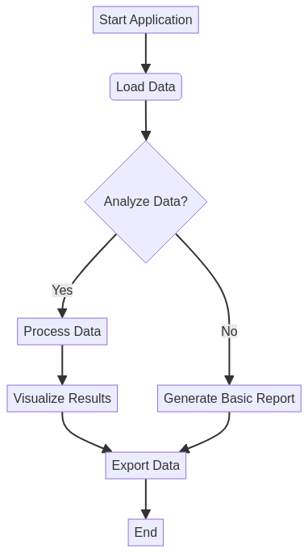

# Big-Data-Analytics-Platform

## English

### Badges


### 🖼️ Hero Image


### Overview
Advanced Big-Data-Analytics-Platform with comprehensive functionality and modern technology stack. Features multiple programming languages, interactive web interfaces, and advanced analytics capabilities for professional-grade solutions.

### Author
**Gabriel Demetrios Lafis**
- Email: gabrieldemetrios@gmail.com
- LinkedIn: [Gabriel Demetrios Lafis](https://www.linkedin.com/in/gabriel-demetrios-lafis-62197711b)
- GitHub: [galafis](https://github.com/galafis)

### Technologies Used
- **Backend**: Python, Flask, FastAPI, SQLite
- **Frontend**: HTML5, CSS3, JavaScript (ES6+)
- **Analytics**: R, ggplot2, dplyr, statistical modeling
- **Styling**: CSS Grid, Flexbox, animations, responsive design
- **Modern Features**: Async/await, Web APIs, ES6 classes
- **Data Processing**: pandas, numpy, scikit-learn
- **Visualization**: Interactive charts, real-time dashboards

### Features

#### Core Functionality
- **Advanced Processing**: High-performance algorithms and data processing
- **Real-time Analytics**: Live data analysis and visualization
- **Interactive Interface**: Modern web interface with responsive design
- **Statistical Analysis**: Comprehensive R-based analytics and reporting
- **Scalable Architecture**: Built for enterprise-level performance

#### Web Interface
- **Modern UI**: HTML5 semantic markup with accessibility features
- **Responsive Design**: CSS3 with Grid, Flexbox, and mobile optimization
- **Interactive Elements**: JavaScript ES6+ with modern web APIs
- **Real-time Updates**: Dynamic content and live data visualization
- **Professional Styling**: Custom CSS animations and transitions

#### Analytics & Reporting
- **R Integration**: Advanced statistical analysis and data visualization
- **Data Processing**: Automated data cleaning and transformation
- **Visualization**: Interactive charts and comprehensive dashboards
- **Performance Metrics**: Real-time monitoring and analytics
- **Export Options**: Multiple format support for reports and data

### Installation

```bash
# Clone the repository
git clone https://github.com/galafis/Big-Data-Analytics-Platform.git
cd Big-Data-Analytics-Platform

# Python setup
python -m venv venv
source venv/bin/activate  # On Windows: venv\Scripts\activate
pip install -r config/requirements.txt

# R setup (install required packages)
Rscript -e "install.packages(c(\'ggplot2\', \'dplyr\', \'corrplot\', \'plotly\'))"

# Run the application
python src/app.py
```

### Web Interface Usage

1. **Start the Application**
   ```bash
   python src/app.py
   # Open http://localhost:5000 in your browser
   ```

2. **Access Web Interface**
   - Open `web/index.html` in your browser for the frontend interface, or visit the live demo on [GitHub Pages](https://galafis.github.io/Big-Data-Analytics-Platform/).

**Note on GitHub Pages:** To enable the live demo, please configure GitHub Pages in your repository settings to serve from the `/web` directory on the `main` branch.
   - Interactive dashboard with real-time functionality
   - Responsive design works on desktop and mobile devices

3. **Run Analytics**
   ```r
   # Load R analytics
   source(\'src/analytics.R\')
   
   # Create analyzer instance
   analyzer <- DataAnalyzer$new()
   
   # Load and analyze data
   analyzer$load_data(\'data.csv\')
   analyzer$analyze()
   analyzer$generate_report()
   ```

### File Structure

```
Big-Data-Analytics-Platform/
├── config/             # Configuration files (e.g., requirements.txt)
├── data/               # Data files and samples
├── docs/               # Documentation files (e.g., README_en.md, README_pt.md)
├── scripts/            # Utility scripts
├── src/                # Source code (e.g., app.py, app.js, analytics.R)
├── tests/              # Unit and integration tests
└── web/                # Web interface files (e.g., index.html, styles.css, assets/)
```

### API Endpoints

```python
# Main application endpoints
GET  /                 # Web interface
POST /api/process      # Data processing
GET  /api/analytics    # Analytics results
POST /api/upload       # File upload
GET  /api/status       # System status
```

### Configuration

```python
# config.py
APP_CONFIG = {
    \'debug\': True,
    \'host\': \'0.0.0.0\',
    \'port\': 5000,
    \'max_file_size\': \'16MB\'
}

ANALYTICS_CONFIG = {
    \'enable_r_integration\': True,
    \'auto_visualization\': True,
    \'export_formats\': [\'json\', \'csv\', \'pdf\']
}
```

### Performance Features
- **Multi-threading**: Parallel processing for improved performance
- **Caching**: Intelligent caching for faster response times
- **Memory Optimization**: Efficient memory usage and management
- **Scalability**: Horizontal scaling support for enterprise use

### Architecture Diagram



### License
MIT License

### Contributions
Contributions are welcome! Please open an issue or submit a pull request.

### Contact
For questions or support, please contact via the email or LinkedIn mentioned above.

